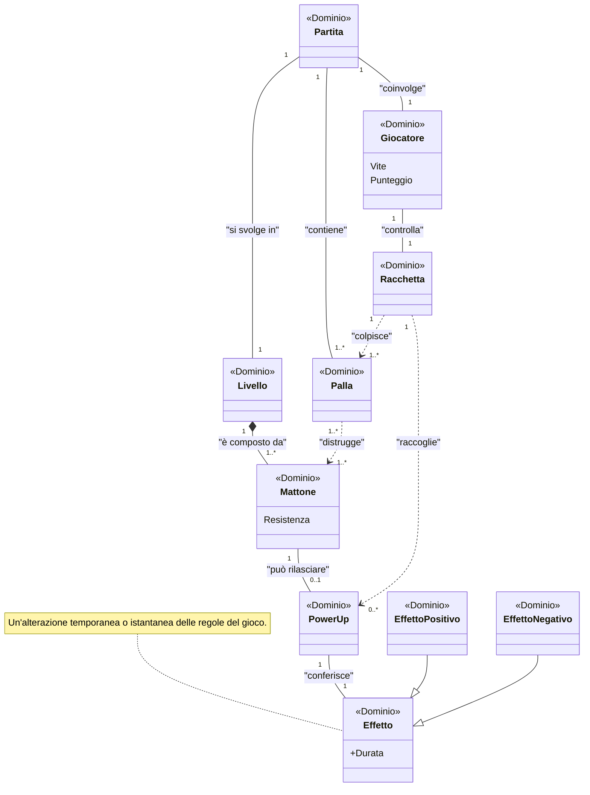
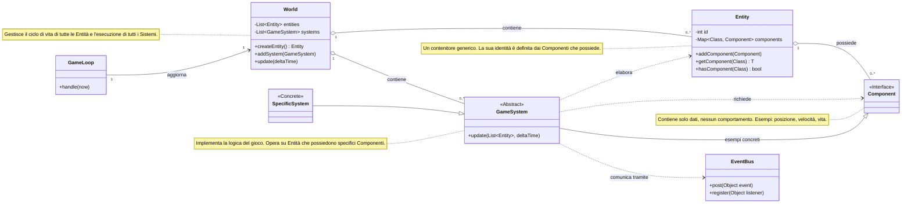
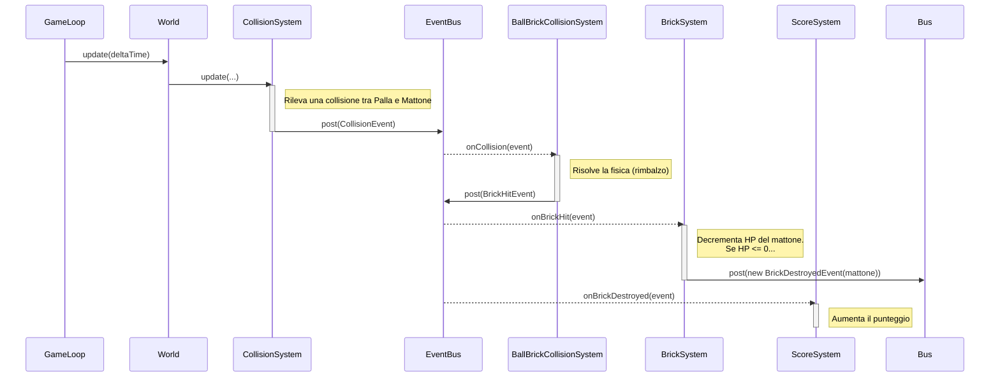
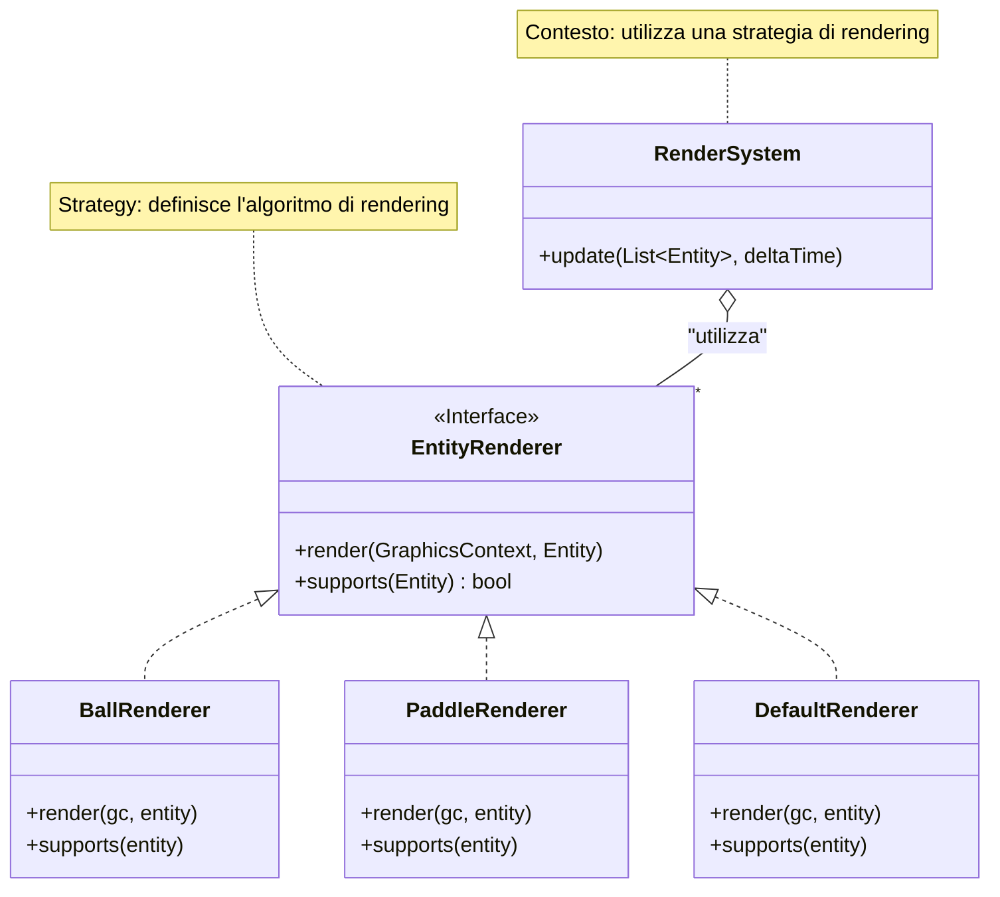
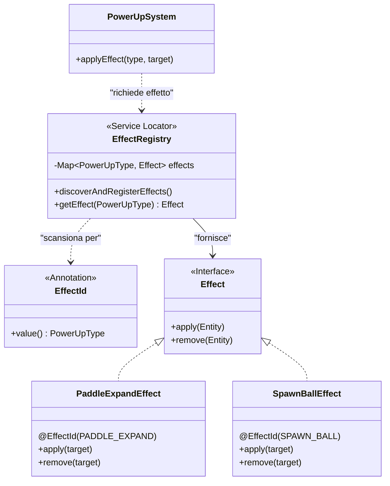
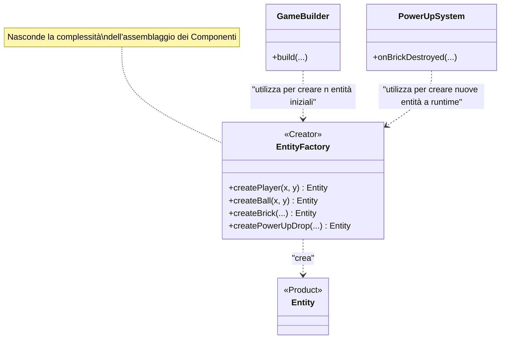

# Relazione su Hakai - PSS23-24

# Analisi

Lo scopo di questo progetto è di ricreare una versione modernizzata del famosissimo arcade [Breakout](https://en.wikipedia.org/wiki/Breakout_(video_game)). 
Il gioco, noto per la sua semplicità e il gameplay avvincente, consiste nel controllare una barra (paddle) per far rimbalzare una palla che distrugge dei mattoni disposti in alto nello schermo. 

## Requisiti funzionali

- L'applicazione dovrà essere gestire un mondo 2D e rispondere agli input dell'utente in modo fedele. In particolare,
il software dovrà gestire cose come la fisica tra le entità del mondo, visualizzazione e animazioni su schermo.
- L'applicazione dovrà presentare più livelli e meccaniche rispetto al classico Breakout.
- L'applicazione dovrà riprodurre suoni coerenti con ciò che succede nel mondo di gioco.

## Requisiti non funzionali

- L'applicazione deve gestire le proprie risorse in maniera accettabile, in quanto del codice scritto male
potrebbe portare a problemi di performance e di conseguenza una esperienza di gioco povera.
- L'applicazione deve essere scalabile anche per designer: una persona che non è in grado di programmare deve comunque
disporre di un sistema semplice e accessibile per aggiungere suoni, livelli, o immagini.

## Analisi e modello del dominio

Il sistema dovrà essere in grado di gestire una sessione di gioco (una Partita). 
Ciascuna partita si svolge all'interno di un singolo Livello, un'area di gioco definita da un insieme di Mattoni disposti secondo uno schema.

All'interno della partita, un Giocatore controlla una Racchetta con lo scopo di colpire una o più Palle. 
Il Giocatore è caratterizzato da un Punteggio e da un numero finito di Vite. La Palla, una volta lanciata, si muove autonomamente e 
interagisce con gli elementi del livello: rimbalza sui bordi e sulla Racchetta, e distrugge i Mattoni che colpisce.

La distruzione di un Mattone può rilasciare un Power-Up, un oggetto speciale che, se raccolto dalla Racchetta del Giocatore, 
applica un Effetto temporaneo o istantaneo. Gli Effetti possono essere positivi (ad esempio, un potenziamento per il Giocatore) o 
negativi (un malus che aumenta la difficoltà).

La Partita termina quando il Giocatore esaurisce le Vite a sua disposizione o quando tutti i Mattoni del Livello vengono distrutti.

Diagramma UML del dominio:



La difficoltà primaria risiede nel costruire un'architettura che permetta di aggiungere molteplici entità o meccaniche
in maniera semplice, veloce, ed affidabile.

La sola complessità della scrittura dell'architettura ha portato via la maggioranza del monte ore previsto
per la realizzazione di questo progetto, per cui in questa versione del software sussistono pochi livelli e pochi powerup.

Il requisito non funzionale riguardo la gestione efficiente delle risorse non potrà essere portato a termine nelle ore
previste, poiché prevede l'implementazione di sistemi di caching particolari e uno studio più approfondito a riguardo.

# Design

## Architettura

L'architettura di Hakai segue il pattern [ECS (Entity-Component-System)](https://en.wikipedia.org/wiki/Entity_component_system).

Questa scelta è motivata dalla necessità di gestire un gran numero di oggetti di gioco (entità) con comportamenti complessi e mutevoli in modo flessibile e performante.
Per renderizzare un elemento a schermo capace di muoversi, ad esempio, mi basta creare un'entità che incorpori in sé `RenderComponent` e `MovableComponent`;
i sistemi relativi penseranno in automatico a gestirne la logica. 
ECS favorisce la composizione rispetto all'ereditarietà, disaccoppiando completamente i dati (i Componenti) dalla 
logica (i Sistemi).

Il cervello principale della nostra applicazione sono i **sistemi**, ovvero classi di codice *stateless* che agiscono sulle entità
alle quali vengono aggiunti **componenti**, i quali non hanno nessuna logica di implementazione al loro interno, ma semplici attributi.

I sistemi utilizzano `World`, un contenitore di tutte le entità e i sistemi presenti nel mondo di gioco, per cercare le 
entità con dei componenti specifici, ed una volta trovate, eseguono la loro logica. `World` esegue ad ogni frame
la logica dei sistemi.



Per permettere una comunicazione disaccoppiata tra i sistemi, è stato introdotto un EventBus. Quando un sistema rileva 
un evento di gioco significativo (es. una collisione), non invoca direttamente un altro sistema, ma pubblica un evento. 
Altri sistemi, interessati a quell'evento, si registrano come ascoltatori e reagiscono di conseguenza. Questo previene 
dipendenze dirette e aumenta la modularità.

Per esemplificare il flusso di comunicazione, il diagramma di sequenza seguente mostra cosa accade quando una palla 
colpisce un mattone. Si noti come CollisionSystem non conosca l'esistenza di BrickSystem o ScoreSystem; la comunicazione 
avviene esclusivamente tramite la pubblicazione di eventi sull' EventBus, che agisce da mediatore.



## Design Dettagliato

Questa sezione approfondisce le decisioni di progettazione chiave adottate per garantire la flessibilità, l'estensibilità 
e la manutenibilità dell'applicazione Hakai. Per ogni scelta, viene descritto il problema affrontato, la soluzione implementata e i pattern di progettazione utilizzati.

### 1. Gestione del Rendering Flessibile e Estensibile

Il gioco richiede di visualizzare diversi tipi di entità (la racchetta, la palla, i mattoni, i power-up), ciascuna con un'estetica unica e complessa che va oltre un semplice rettangolo colorato. 
Una soluzione ingenua avrebbe potuto inserire una serie di if-else o switch all'interno del RenderSystem per decidere come disegnare ogni entità. Questo approccio avrebbe reso il RenderSystem rigido, difficile da estendere con nuove entità e incline a violare il principio Open/Closed, in quanto ogni nuova entità avrebbe richiesto una modifica al suo codice.

Per risolvere questo problema, la logica di rendering è stata disaccoppiata dal sistema principale. Il RenderSystem non sa come disegnare un'entità specifica; il suo unico compito è iterare sulle entità renderizzabili e delegare il disegno a un oggetto specializzato. Questa responsabilità è stata incapsulata nell'interfaccia EntityRenderer. Ogni classe concreta che implementa questa interfaccia (es. BallRenderer, PaddleRenderer) contiene la logica specifica per disegnare un tipo di entità.

Questa soluzione implementa lo [Strategy design pattern](https://refactoring.guru/design-patterns/strategy). Ricapitolando:

- Il RenderSystem, che deve eseguire l'algoritmo di rendering.
- L'interfaccia EntityRenderer, che definisce il contratto comune per tutti gli algoritmi di rendering.
- Le classi BallRenderer, PaddleRenderer, BrickRenderer, ecc., che forniscono le implementazioni specifiche dell'algoritmo di renderizzazione.

Il RenderSystem seleziona la strategia appropriata per ogni entità chiamando il metodo supports(Entity), e la esegue invocando render(gc, entity). Questo permette di aggiungere nuovi stili di rendering o di supportare nuove entità semplicemente creando una nuova classe EntityRenderer, senza modificare minimamente il RenderSystem.


### 2. Scoperta e Registrazione Automatica degli Effetti dei Power-Up

Il gioco deve supportare un numero crescente di Power-Up e malus, ciascuno con un effetto unico. Questi effetti sono definiti nei file di configurazione dei livelli tramite una stringa identificativa (es. "PADDLE_EXPAND"). Era necessario un meccanismo per mappare queste stringhe alle classi Java che implementano la logica dell'effetto, evitando registrazioni manuali che sono soggette a errori e rendono l'aggiunta di nuovi effetti macchinosa. Aggiungere un nuovo effetto non dovrebbe richiedere la modifica di codice esistente in una factory o in un registro centrale.

La soluzione adotta un meccanismo di scoperta automatica al momento dell'avvio, che implementa una variante del [Service Locator](https://www.geeksforgeeks.org/system-design/service-locator-pattern/) pattern. La classe EffectRegistry è responsabile di trovare e istanziare tutte le classi che implementano l'interfaccia Effect.

Per ottenere questo, è stato utilizzato un approccio basato sulla reflection [(tramite la libreria ClassGraph)](https://github.com/classgraph/classgraph) e sulle annotazioni Java:

- L'interfaccia Effect definisce il contratto per tutti gli effetti (i metodi apply, remove, getDuration, ecc.).
- Un'annotazione custom, @EffectId, viene usata per associare un enum PowerUpType a ogni implementazione concreta di Effect.
- All'avvio, EffectRegistry scansiona il classpath, cerca tutte le classi annotate con @EffectId, le istanzia e le memorizza in una mappa, usando il valore dell'annotazione come chiave.

Quando il PowerUpSystem deve applicare un effetto, non lo istanzia direttamente, ma lo richiede all'EffectRegistry tramite il suo PowerUpType. Questo design rende il sistema estremamente estensibile: per aggiungere un nuovo effetto, uno sviluppatore deve solo creare una nuova classe che implementa Effect e annotarla con @EffectId. Non è richiesta alcuna modifica al registro o ai sistemi che lo utilizzano.



### 3. Creazione Semplificata delle Entità di Gioco

La creazione di un'entità di gioco in un'architettura ECS richiede l'istanziazione dell'`Entity` e l'aggiunta di tutti i `Component` necessari. Ad esempio, per creare una "palla" non basta un `new Ball()`, ma bisogna assemblare `PositionComponent`, `VelocityComponent`, `RenderComponent`, `BallComponent` e `CollidableComponent`, ognuno con i propri valori di default. Spargere questa logica di assemblaggio in più punti del codice avrebbe portato a duplicazione e a difficoltà di manutenzione: un cambiamento alla "definizione" di palla avrebbe richiesto modifiche in più file.

Per centralizzare e semplificare questo processo, è stata creata la classe EntityFactory, che implementa il design pattern [Factory Method](https://refactoring.guru/design-patterns/factory-method).

- L'interfaccia implicita è l'`Entity` configurata.
- Le entità concrete come "Player", "Ball", "Brick", che sono il risultato dei metodi della factory.
- Creator: La classe EntityFactory stessa.
- Factory Methods: I metodi come createPlayer(...), createBall(...), createBrick(...).

Questa classe nasconde la complessità dell'assemblaggio dei componenti. Il resto dell'applicazione (es. il `GameBuilder` all'avvio o un `PowerUpSystem` che deve creare una nuova palla) non ha bisogno di conoscere i dettagli di quali componenti formino un'entità. Chiama semplicemente un metodo descrittivo come `entityFactory.createLaunchedBall(x, y)`.

Questo approccio ha diversi vantaggi:
- Centralizzazione: La "ricetta" per ogni tipo di entità è in un unico posto.
- Semplificazione: Il "client" deve solo chiamare un metodo, senza preoccuparsi dei dettagli di costruzione.
- Consistenza: Tutte le entità dello stesso tipo vengono create nello stesso modo, con gli stessi componenti di base.



# Sviluppo

## Testing Automatizzato

La scelta è ricaduta sull'implementazione di unit test per i componenti architetturali più critici: i `GameSystem`. Questa decisione è motivata dal fatto che i sistemi incapsulano la logica di business in modo isolato e, essendo progettati per essere stateless, si prestano perfettamente a essere testati singolarmente.

Per la realizzazione dei test sono stati utilizzati i seguenti framework: JUnit 5 per la struttura dei test e l'esecuzione delle asserzioni, e Mockito per la creazione di mock object. L'uso di mock è stato fondamentale per isolare ogni sistema sotto test, simulando le sue dipendenze 
(come l'EventBus o l'`InputManager`) e verificando che le interazioni con esse avvengano come previsto.

Sono stati sottoposti a test i seguenti sistemi:

- `ScoreSystem`: Per verificare il corretto incremento del punteggio alla distruzione di un mattone.

- `LivesSystem`: Per assicurare la corretta gestione delle vite del giocatore quando una palla viene persa e la corretta gestione della condizione di game over.

- `BrickSystem`: Per testare la logica di danneggiamento e distruzione dei mattoni.

- `BallSystem`: Per verificare il comportamento della palla, in particolare la logica di lancio e di adesione alla racchetta.

- `MovementSystem`: Per validare la risposta della racchetta agli input simulati dell'utente.

- `CollisionSystem`: Per verificare che le collisioni tra entità vengano correttamente rilevate e che i relativi eventi vengano pubblicati. Le logiche di risposta specifiche sono state testate nei sistemi dedicati, ovvero:
    - `BallBrickCollisionSystemTest`
    - `BallPaddleCollisionSystemTest`
    - `PaddlePowerUpCollisionSystemTest`

- `PowerUpSystem`: Per testare l'applicazione degli effetti e la generazione dei power-up collezionabili.

- `PhysicsSystem`: Per testare la corretta esecuzione della fisica di gioco.

- `LevelCompletionSystem`: Per verificare che vengano prodotti gli eventi corretti quando si pulisce interamente un livello.

- `LevelManagerTest`: Per verificare il corretto caricamento e generazione dei livelli.


I test non coprono l'interfaccia grafica poiché l'obiettivo primario era validare la correttezza della logica di gioco; sono consapevole che è possibile testare l'interfaccia grafica, ma ho preferito non farlo per concentrare le mie energie su altro.
Altri elementi core del motore di gioco non sono stati testati per mancanza di tempo.

## Note di sviluppo

Di seguito elencherò 4 pezzi di codice che credo di aver scritto bene e che mi hanno risolto tanti problemi e fatica sul lungo termine:

1. Scoperta automatica di servizi tramite reflection - `com.zekecode.hakai.powerups.EffectRegistry`
```java
private void discoverAndRegisterEffects() {
  String effectPackage = "com.zekecode.hakai.powerups.effects";
  String annotationName = EffectId.class.getName();

  try (ScanResult scanResult =
      new ClassGraph().enableAllInfo().acceptPackages(effectPackage).scan()) {
    ClassInfoList effectClasses =
        scanResult
            .getClassesImplementing(Effect.class.getName())
            .filter(classInfo -> classInfo.hasAnnotation(annotationName));

    effectClasses
        .loadClasses(Effect.class)
        .forEach(cls -> { // ... istanziazione e registrazione ... });
  }
  System.out.println("Effect discovery complete. " + effects.size() + " effects loaded.");
}
```
[Clicca su questo permalink per visualizzare il metodo direttamente sulla classe in questione.](https://github.com/zeke-code/pss23-24-hakai-Spina/blob/702a798d22301606babce949d7185daa521546e0/app/src/main/java/com/zekecode/hakai/powerups/EffectRegistry.java#L30)

2. Utilizzo di Guava Event Bus per disaccoppiare classi molto diverse tra loro ed evitare dipendenze continue (particolarmente utile per il `SoundManager`!) - `com.zekecode.hakai.engine.sounds.SoundManager`
```java
public class SoundManager {

  private final Map<String, AudioClip> soundEffects = new HashMap<>();
  private Map<String, String> eventToSoundMap = new HashMap<>();

  /**
   * Listens for ANY event published on the event bus. If the event's class name 
   * is registered in our map, it plays the corresponding sound.
   */
  @Subscribe
  public void handleAnyEvent(Object event) {
    String eventClassName = event.getClass().getSimpleName();
    String soundToPlay = eventToSoundMap.get(eventClassName);

    if (soundToPlay != null) {
      playSound(soundToPlay);
    }
  }
  // ...
}
```

[Clicca su questo permalink per visualizzare la classe in questione.](https://github.com/zeke-code/pss23-24-hakai-Spina/blob/702a798d22301606babce949d7185daa521546e0/app/src/main/java/com/zekecode/hakai/engine/sounds/SoundManager.java#L19)

3. Implementazione di `Entity` con `Optional` e Generics per evitare NullPointerExceptions a runtime - `com.zekecode.hakai.core.Entity`

```java
public class Entity {
  private final Map<Class<? extends Component>, Component> components = new HashMap<>();

  /**
   * Retrieves a component of the specified type from this entity.
   * @return An Optional containing the component if it exists, or empty if it does not.
   */
  @SuppressWarnings("unchecked")
  public <T extends Component> Optional<T> getComponent(Class<T> componentClass) {
    return Optional.ofNullable((T) components.get(componentClass));
  }
}
```

[Clicca su questo permalink per visualizzare il metodo direttamente sulla classe in questione.](https://github.com/zeke-code/pss23-24-hakai-Spina/blob/702a798d22301606babce949d7185daa521546e0/app/src/main/java/com/zekecode/hakai/core/Entity.java#L55)

4. Implementazione di `LevelLoader` per leggere dinamicamente i file YAML che definiscono i livelli tramite [SnakeYAML](https://github.com/snakeyaml/snakeyaml) - `com.zekecode.hakai.engine.game.LevelLoader`
```java
public LevelData loadAndBuildLevel(String levelFile) {
    LevelData level = levelLoader.loadLevel(levelFile);
    LayoutData layout = level.layout;

    List<String> pattern = layout.pattern;
    for (int row = 0; row < pattern.size(); row++) {
        String rowPattern = pattern.get(row);
        for (int col = 0; col < rowPattern.length(); col++) {
            char brickChar = rowPattern.charAt(col);
            if (brickChar == '.') {
                continue; // Skip empty spaces
            }

            BrickTypeData type = level.brickTypes.get(brickChar);
            // ... null check ...

            // Determine brick dimensions, using defaults
            double brickWidth = (type.width != null) ? type.width : layout.defaultBrickWidth;
            double brickHeight = (type.height != null) ? type.height : layout.defaultBrickHeight;

            // Calculate brick position based on grid
            double x = (col * (layout.defaultBrickWidth + layout.padding)) + layout.padding;
            double y = (row * (layout.defaultBrickHeight + layout.padding)) + layout.offsetTop;

            entityFactory.createBrick(x, y, brickWidth, brickHeight, ...);
        }
    }
    return level;
}
```

La classe `Entity` è stata riadattata da [Ashley](https://github.com/libgdx/ashley/blob/master/ashley/src/com/badlogic/ashley/core/Entity.java), ECS framework messo a disposizione dal framework LibGDX.
Ciò mi è servito per gettare delle basi solide per un framework custom ECS in modo da non reinventare la ruota. Inoltre, alcuni pezzi di codice sono stati suggeriti da IA generativa; tuttavia sono stati quasi sempre modificati e hanno servito come base di ciò che poi è stato invece implementato.

# Commenti finali

Autovalutandomi direi di aver fatto un progetto ok, anche se un po' vuoto poiché mi sono voluto concentrare prevalentemente su un'architettura scalabile e modulare. 
Non avevo mai implementato un simil motore grafico di gioco da zero, per cui la ricerca e la scelta dell'architettura giusta sono state cose che mi ha portato via molto.

Credo di poter fare di molto meglio, ma è stata un'esperienza estremamente formativa in programmazione e architettura di software. 
Il progetto attuale rappresenta comunque una solida base ("proof of concept") su cui è possibile costruire facilmente, aggiungendo nuovi livelli, entità e meccaniche di gioco semplicemente creando nuovi componenti o file di configurazione.

## Difficoltà incontrate e commenti per i docenti

La sfida principale è stata tradurre i principi teorici dell'ECS in un'implementazione concreta e funzionante, una decisione che ha richiesto un significativo investimento di tempo in fase di progettazione. Ritengo che questo investimento sia stato ripagato dalla modularità e dalla flessibilità del sistema risultante.

Sarebbe ottimo riservare un pochino di tempo bel corso per parlare di Design Pattern. Forse il tempo a vostra disposizione non è sufficiente, ma credo siano un ottimo modo per ricevere anche agli esami codice di più alta qualità,
e istruendo gli studenti prima, riusciamo anche a farli sclerare un pochino di meno quando scrivono il progetto. Per mia fortuna ero già a conoscenza di vari design, ho solamente dovuto approfondire la loro implementazione.

Specialmente all'inizio, è stato difficile definire un framework custom da utilizzare per il progetto, e la sua implementazione non mi è stata molto chiara sin dal principio. Mi sono aiutato tantissimo grazie a questi due video:
- [Overwatch Gameplay Architecture (by Blizzard)](https://www.gdcvault.com/play/1024001/-Overwatch-Gameplay-Architecture-and) - questo video mi ha dato un esempio molto chiaro e approfondito, anche se in C++, di come implementare il mio framework ECS, e di che aspetto dovevano avere le mie classi.
- [Coding a 2D Game Engine in Java (e in particolare il video Entity Component System)](https://www.youtube.com/watch?v=HkG8ZdhoXhs&list=PLtrSb4XxIVbp8AKuEAlwNXDxr99e3woGE&index=11) - questo video mi ha schiarito alcuni dubbi che avevo, oltre a spiegare la storia del framework ECS (e di come in Java sia particolarmente inutile dal punto
di vista di performance.)

Sarebbe carino accennare altre architetture oltre alla classica MVC nel corso per portare anche più varietà nei progetti presentati.

# Guida utente

1. Scaricare il videogioco dalla sezione `Release` di GitHub.
2. Avviare il file scaricato attraverso il seguente comando:
```bash
java -jar Hakai-<YOUR_OS>.jar
```
3. Sul menù principale è possibile cliccare col mouse sul pulsante "How To Play" per avere una breve descrizione dei comandi e dell'obiettivo del gioco.
4. Cliccare sul tasto play col mouse e selezionare un livello.
5. Usare WASD per muoversi e lanciare la palla.
